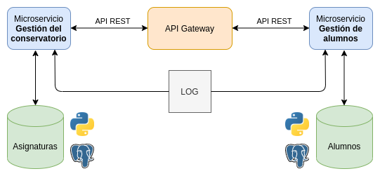

# Proyecto de Cloud Computing

[](https://www.gnu.org/licenses/gpl-3.0)

Repositorio para el proyecto (con propósito educativo) de Cloud Computing: Fundamentos e Infraestructuras (2020-21) del Máster en Ingeniería Informática UGR.

El ambiente de trabajo necesario para la asignatura y en el cual se va a implementar dicho proyecto se puede consultar en este [link](https://github.com/Carlossamu7/CC1-Proyecto/blob/master/docs/set-up.md).

## Descripción del problema

Una escuela de música o conservatorio privado tiene todo su registro de alumnos, profesores, horarios y otros en papel. Dicho conservatorio quiere actualizarse de modo puedan hacer eso computacionalmente lo cual les ahorraría mucho trabajo y evitaría que la pérdida de un papel suponga un fallo grave para la empresa.

## Descripción de la solución

Este proyecto esta dirigido a dar una solución cloud a este problema. La solución consistiría en mantener el registro de alumnos y su matriculación a asignaturas del centro. Para ello se usaría una plataforma donde los administradores puedan dar de alta una asignatura y los alumnos que lo deseen matricularse en ella y poder informarse de aspectos como el horario o el aula.

## Arquitectura

Después de estudiar las diferentes arquitecturas e indagar las ventajas e inconvenientes de cada una he elegido una arquitectura basada en **microservicios**.
Las ventajas de esta arquitectura son numerosas, de ahí la popularidad en su uso. Por ejemplo la independencia de cada uno de los microservicios e incluso poder implementarlos en lenguajes distintos consiguiendo una mayor eficiencia. Esto ayuda al mantenimiento y desarrollo de los mismos así como la robustez frente a fallos: la caída de un servicio no implica la del otro.

En este proyecto hay dos grandes microservicios:

- **Gestión del conservatorio**. Dar de alta, borrar y modificar asignaturas. Cada asignatura tiene un horario, un aula y profesor asociado.

- **Gestión de alumnos**. Darse de alta en el conservatorio mediante la matricula en las asignaturas deseadas.



## Aspectos del proyecto

##### Lenguaje

Los servicios de la aplicación van a estar implementados en `Python3`. En concreto se va a dar mantenibilidad de las versiones `3.6`, `3.7` y `3.8` ([documentación de las versiones](https://www.python.org/doc/versions/)). El framework de comunicación que se va a usar para desarrollar las `API REST` es `Flask`.

##### Entorno vitual

El entorno virtual que se va a usar para las versiones mencionadas es el conocido `virtualenv` para `Python`.

##### Base de datos

Se usará la base de datos relacional PostgreSQL. Su uso en Python se hará a través de `peewee`.

##### Herramienta de construcción

Se ha valorado la opción de usar `Invoke` pero la opción final ha sido la herramienta clásica `Makefile`.

```
buildtool: Makefile
```

Con la siguiente orden se instalan las versiones de los paquetes que el proyecto necesita

```
make install
```

Básicamente lanzará la orden `pip3 install -r requirements.txt`, en donde las dependencias están en `requirements.txt`.

Para ejecutar los test se usará `unittest` disponible en las distribuciones de `Python`. En el directorio `tests` de este repositorio se irán situando los diferentes programas de test y los podremos lanzar con

```
make test
```

Más adelante, cuando sea necesaria la limpieza de archivos generados podremos automatizarla llevándola acabo con:

```
make clean
```

##### Integración continua

La herramienta de integración continua del proyecto va a ser [Travis CI](https://travis-ci.org/getting_started). Travis comprueba que los tests se ejecuten correctamente para las versiones especificadas en `.travis.yml`.

##### Sistema de logging

La gestión de logs se realizará usando la libreria `logging` de `Python`.

## Licencia

Este proyecto está desarrollado bajo licencia [GNU General Public License v3.0](https://es.wikipedia.org/wiki/GNU_General_Public_License).
