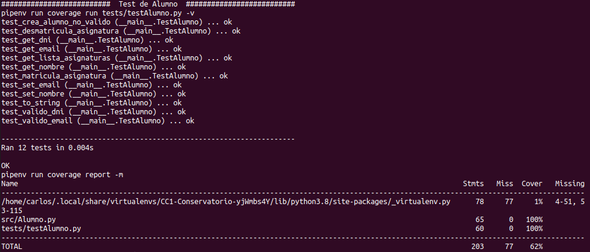
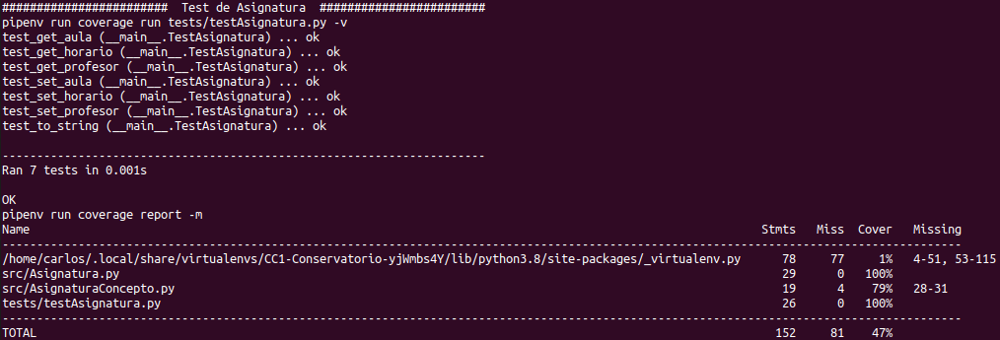
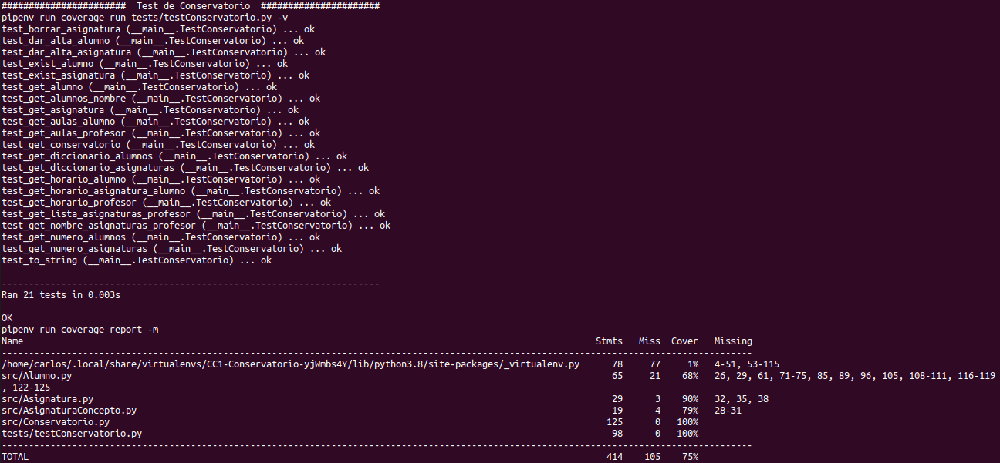

# Proyecto *MiConservatorio* de Cloud Computing

[](https://www.gnu.org/licenses/gpl-3.0)

Repositorio para el proyecto (con propósito educativo) de **Cloud Computing**: Fundamentos e Infraestructuras (2020-21) del Máster en Ingeniería Informática UGR.

## Información ##

Este proyecto es para la aplicación de gestión de un Conservatorio privado. Dependiendo de la correción consúltese:

- [Descripción del problema](https://github.com/Carlossamu7/CC1-Conservatorio/blob/master/docs/descripcion.md)

## Arquitectura y Roadmap ##

- [Arquitectura elegida](https://github.com/Carlossamu7/CC1-Conservatorio/blob/milestone2/docs/arquitectura.md)
- [Roadmap](https://github.com/Carlossamu7/CC1-Conservatorio/blob/milestone2/docs/roadmap.md)
- [Clases y estructura del proyecto](https://github.com/Carlossamu7/CC1-Conservatorio/blob/milestone2/docs/clasessindetalle.md)

## Test ##

Los test del código resultan fundamentales en el desarrollo de proyectos actual por diferentes motivos. Por un lado, se ha de tener en cuenta el coste que supondría desplegar una aplicación con errores y por otro para asegurar la calidad del código mediante la comprobación de los requisitos planteados, como son las historias de usuario. Además, los test van a convertirse en un elemento esencial para la automatización de los ciclos de vida del software.

Las pruebas que se van a realizar por el momento son **unitarias** ya que las comprobaciones que se van a hacer son llamadas a una función con diferentes parámetros y asegurando que los resultados son los deseados. El diseño de software de este proyecto es usando **desarrollo basado en tests**, donde es preferible programar los test sabiendo qué se desea obtener y posteriormente el código.

### Librería de aserciones & Marco de pruebas ###

En mi caso, que estoy implementando el proyecto en `Python3` y el **marco de pruebas** que he elegido es `unittest`. Un motivo para esta elección es que está integrado en Python y es todo un estándar por lo que hay bastante información al respecto. Se puede consultar información relevante de `unittest` en esta [documentación oficial](https://docs.python.org/3/library/unittest.html). Resulta cómodo hacer TDD mediante esta biblioteca.

En `Python` encontramos diferenes **aserciones explícitas** con `assert`. Se pueden consultar [todas las aserciones](https://docs.python.org/3/library/unittest.html#assert-methods) pero resumo a continuación las que más he usado:
- `assertTrue`: fallará sólo si no devuelve `True`.
- `assertFalse`: fallará sólo si no devuelve `False`.
- `assertEqual`: fallará sólo si los dos argumentos no son iguales.
- `assertRaises`: fallará si no se lanza una excepción del tipo indicado. En este [link](https://ongspxm.gitlab.io/blog/2016/11/assertraises-testing-for-errors-in-unittest/) se muestras diferentes formas de usarlo y una de ellas muy elegante.

Personalmente la filosofía de  otras librerías como `doctest` no me gustan tanto porque llevan las ejecuciones y resultados comentados encima de cada método/función alargando mucho el código. Para mí es preferible que si ahí hay que poner algún comentario sea del método o función y por otro lado independientes los test. Por esto descarté `doctest`.

Otras opciones como `pytest` están ampliamente aceptadas y usandas por programadores `Python`. Una desventaja es que no viene integrado y es necesaria su instalación y [documentándome](https://stackoverflow.com/questions/27954702/unittest-vs-pytest) me pareció más intuitivo `unittest`.

### Test ###

He implementado tres clases `TestAlumno` ([ver](https://github.com/Carlossamu7/CC1-Conservatorio/blob/master/tests/testAlumno.py)), `TestAsignatura` ([ver](https://github.com/Carlossamu7/CC1-Conservatorio/blob/master/tests/testAsignatura.py)) y `TestConservatorio` ([ver](https://github.com/Carlossamu7/CC1-Conservatorio/blob/master/tests/testConservatorio.py)) que son subclases de `unittest.TestCase`. He procurado seguir lo que considero que son buenos hábitos a la hora de programar tests. Dejo aquí anotados los más importantes:

- Cada test prueba una pequeña funcionalidad y demuestra que es correcta.
- Cada función test es independiente y se puede ejecutar por separado.
- Los tests se ejecutan rápidamente.
- Cada test unitario tiene un propósito claro y el nombre de la función es largo y descriptivo.

La ejecución de un test es como un programa en `Python`:

```
python3.8 tests/testAlumno.py
python3.8 tests/testAsignatura.py
python3.8 tests/testConservatorio.py
```

Para ejecutarlo en el entorno virtual sería a través de `pipenv`, documentación [aquí](https://pipenv-es.readthedocs.io/es/latest/). También he usado la herramienta `coverage` para medir qué zonas del código se han ejecutado y cuáles no. Esto me permite mantener un control más detallado ([fuente](https://coverage.readthedocs.io/en/coverage-5.3/)).


```
##########################  Test de Alumno  ##########################
pipenv run coverage run tests/testAlumno.py -v
pipenv run coverage report -m
########################  Test de Asignatura  ########################
pipenv run coverage run tests/testAsignatura.py -v
pipenv run coverage report -m
#######################  Test de Conservatorio  ######################
pipenv run coverage run tests/testConservatorio.py -v
pipenv run coverage report -m
```

Veremos más adelante que esto se puede automatizar. Los resultados de las ejecuciones son los que vemos a continuación. Para la clase `Alumno`:



Para la clase `Asignatura`:



Para la clase `Conservatorio`:



Observamos que los test barren el 100% del código de `Alumno.py`, de `Asignatura.py` y de `Conservatorio.py`. Asimismo se ha usado el parámetro `-v` u opción `verbose` para que informe qué test está ejecutando y posteriormente con `pipenv run coverage report -m` nos emite el informe de las zonas de código ejecutadas.

### Gestor de tareas ###

El gestor de tareas que se había elegido para el proyecto es `Makefile`. En él se pueden ejecutar los test unitarios rápidamente con la orden `make test`. Además con `make sintaxis` se puede comprobar la sintaxis de las clases implementadas.

### Avances en el código ###

- Avance notable de prácticamente todas las HU.
- Implementación de `listaAsignaturas()`, `matriculaAsignatura()` y `desmatriculaAsignatura()`. Nuevo formateado para las asignaturas como string.
- Conforme avanza el proyecto se demandan nuevas necesidades para el conservatorio mediante historias de usuario. Creación de las [[HU6]](https://github.com/Carlossamu7/CC1-Conservatorio/issues/39), [[HU10]](https://github.com/Carlossamu7/CC1-Conservatorio/issues/43), [[HU11]](https://github.com/Carlossamu7/CC1-Conservatorio/issues/44), [[HU12]](https://github.com/Carlossamu7/CC1-Conservatorio/issues/45), [[HU13]](https://github.com/Carlossamu7/CC1-Conservatorio/issues/46) y [[HU14]](https://github.com/Carlossamu7/CC1-Conservatorio/issues/47).
- Implementación de una clase controladora `Conservatorio` disponible [aquí](https://github.com/Carlossamu7/CC1-Conservatorio/blob/master/src/Conservatorio.py). Esta clase maneja coleccionables (listas) de `Asignatura` y `Alumno` del Conservatorio ayudando a su gestión. De esta manera se consiguen avanzar algunas de las HU.
- Tratamiento de nuevas excepciones de la clase `Conservatorio`.

*Nota*: las funciones implementadas de rastreo de aulas que ha pisado un alumno/profesor correspondientes a la [[HU14]](https://github.com/Carlossamu7/CC1-Conservatorio/issues/47) son de gran utilidad para periodos como el actual debido a la COVID-19, en donde rastrear el virus es muy importante.

## Licencia

Este proyecto está desarrollado bajo licencia [GNU General Public License v3.0](https://es.wikipedia.org/wiki/GNU_General_Public_License).
