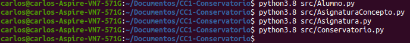

# Proyecto de Cloud Computing

[](https://www.gnu.org/licenses/gpl-3.0)

Repositorio para el proyecto (con propósito educativo) de Cloud Computing: Fundamentos e Infraestructuras (2020-21) del Máster en Ingeniería Informática UGR.

El ambiente de trabajo necesario para la asignatura y en el cual se va a implementar dicho proyecto se puede consultar en este [link](https://github.com/Carlossamu7/CC1-Proyecto/blob/master/docs/set-up.md).

## Descripción del problema

Una escuela de música o conservatorio privado tiene todo su registro de alumnos, profesores, horarios y otros en papel. Dicho conservatorio quiere actualizarse de modo puedan hacer eso computacionalmente lo cual les ahorraría mucho trabajo y evitaría que la pérdida de un papel suponga un fallo grave para la empresa.

##### Descripción de la solución

Este proyecto esta dirigido a dar una solución *cloud* a este problema. La solución consistiría en mantener el registro de alumnos y su matriculación a asignaturas del centro. Para ello se usaría una plataforma donde los administradores puedan dar de alta una asignatura y los alumnos que lo deseen matricularse en ella y poder informarse de aspectos como el horario o el aula.

## Arquitectura

En primer lugar hay que analizar muy bien el problema que estamos tratando de resolver. En dicho problema reconocemos perfectamente dos entidades fundamentales, por un lado las **asignaturas** que son dadas de alta por un administrador del Conservatorio. Se tiene que poder de dar de alta una asignatura, borrarla o modificar aspectos como el horario, el aula o el profesor asociado.

Por otro lado tenemos a los **alumnos** que se matriculan de asignaturas y hacen diversas consultas o cambios en su matrícula. Cada alumno tiene la posibilidad de darse de alta en el conservatorio mediante la matricula en las asignaturas deseadas. También puede matricular más asignaturas y desmatricular asignaturas ya matriculadas, así como hacer diversas consultas.

Después de estudiar las diferentes arquitecturas y teniendo en cuenta el proyecto que se va a desarrollar la arquitectura que mejor se adecúa es una **arquitectura basada en microservicios**. La justificación de esta elección se debe a las ventajas que esta arquitectura ofrece a nuestro problema. La más importante es la independencia entre los microservicios en su desarrollo, en su manejo, en su mantenimiento o en su actualización. Por otro lado hay que tener en cuenta la robustez frente a fallos: la caída de un servicio no implica la del otro. Es posible que conforme avance el proyecto surja la necesidad de integrar una nueva entidad y aumentar la funcionalidad del proyecto por lo que esta arquitectura resulta idónea para la integración de un nuevo microservicio.

Otra razón para esta elección es la posibilidad de una gestión descentralizada de datos, cada microservicio tiene su base de datos. Además, se evita uno de los problemas de estas arquitecturas, que es cuando el número de microservicios es grande y por consiguiente la tarea de gestión se hace más pesada, ya que en principio sólo se va a tener dos grandes microservicios que dirigen cada una de las funcionalidades ya introducidas.

## Herramientas y tecnologías del proyecto

##### Lenguaje

Los servicios de la aplicación van a estar implementados en `Python3`. Se puede consultar la [documentación de las versiones](https://www.python.org/doc/versions/).

##### Entorno vitual

El entorno virtual que se va a usar para las versiones mencionadas es el conocido `virtualenv` para `Python`.

##### Herramienta de construcción

Se va a usar la herramienta clásica `Makefile`. Las tareas que nuestro `Makefile` puede hacer por el momento son:

- `make install`: instala las versiones de los paquetes que el proyecto necesita. Básicamente lanzará la orden `pip3 install -r requirements.txt`, en donde las dependencias están en `requirements.txt`.

- `make test`: ejecuta los tests. Se usará `unittest` disponible en las distribuciones de `Python`. En el directorio `tests` de este repositorio se irán situando los diferentes programas de test.

- `make clean`: limpieza de archivos generados

##### Integración continua

La herramienta de integración continua del proyecto va a ser [Travis CI](https://travis-ci.org/getting_started). Travis comprueba que los tests se ejecuten correctamente para las versiones especificadas en el fichero `.travis.yml`.

## *Roadmap*

Para consultar exclusivamente los *milestone* con sus *issues* entrar [aquí](https://github.com/Carlossamu7/CC1-Conservatorio/blob/master/docs/milestones_hu.md). La planificación del desarrollo del proyecto es la siguiente:

**Fase 1**. Comenzar el desarrollo de los *milestones* de [Administrador](https://github.com/Carlossamu7/CC1-Conservatorio/milestone/4) y de [Alumno](https://github.com/Carlossamu7/CC1-Conservatorio/milestone/3). Cuando dichos *milestone* se hayan alcanzado se dispondrá de un producto mínimamente viable (MVP).

- [[HU1] Como administrador quiero dar de alta una asignatura.](https://github.com/Carlossamu7/CC1-Conservatorio/issues/12)

> Se ha implementado la clase `Asignatura.py` [aquí](https://github.com/Carlossamu7/CC1-Conservatorio/blob/master/src/Asignatura.py).

- [[HU4] Como alumno quiero matricularme de ciertas asignaturas.](https://github.com/Carlossamu7/CC1-Conservatorio/issues/15)

> Se ha implementado la clase `Alumno.py` [aquí](https://github.com/Carlossamu7/CC1-Conservatorio/blob/master/src/Alumno.py). Gestionada la comprobación de DNIs, no se dará de alta a ningún alumno con un DNI no válido en el sistema.

**Fase 2**. Avanzar esos MVP con nuevas historias de usuario que los hacen más funcionales.

- [[HU2] Como administrador quiero modificar una asignatura.](https://github.com/Carlossamu7/CC1-Conservatorio/issues/13)
- [[HU3] Como administrador quiero borrar una asignatura.](https://github.com/Carlossamu7/CC1-Conservatorio/issues/14)
- [[HU5] Como alumno quiero desmatricularme de ciertas asignaturas.](https://github.com/Carlossamu7/CC1-Conservatorio/issues/16)
- [[HU6] Como alumno quiero consultar mis asignaturas matriculadas.](https://github.com/Carlossamu7/CC1-Conservatorio/issues/39)
- [[HU7] Como alumno quiero modificar la dirección de correo con la que el centro se pone en contacto conmigo.](https://github.com/Carlossamu7/CC1-Conservatorio/issues/17)

**Fase 3**. Introducir tests que comprueben y aseguren la calidad del código ya implementado ya que nuestro objetivo es desplegar la aplicación en la nube y estas pruebas confirmarán que el código hace lo que se espera que haga. Los tests comprobarán las HU de alumno y las de administrador.

**Fase 4**. Continuar con el desarrollo de la aplicación avanzando historias de usuario que necesitan de la comunicación de ambos microservicios.

- [[HU8] Como alumno quiero consultar el horario de una asignatura.](https://github.com/Carlossamu7/CC1-Conservatorio/issues/18)
- [[HU9] Como alumno quiero consultar el aula de una asignatura.](https://github.com/Carlossamu7/CC1-Conservatorio/issues/19)
- [[HU10] Como alumno quiero saber mi horario completo.](https://github.com/Carlossamu7/CC1-Conservatorio/issues/43)

> Se ha implementado la clase `Conservatorio.py` [aquí](https://github.com/Carlossamu7/CC1-Conservatorio/blob/master/src/Conservatorio.py).

- [[HU11] Como administrador quiero saber en el número de alumnos y asignaturas del conservatorio.](https://github.com/Carlossamu7/CC1-Conservatorio/issues/44)
- [[HU12] Como administrador quiero saber las asignaturas que imparte un profesor.](https://github.com/Carlossamu7/CC1-Conservatorio/issues/45)
- [[HU13] Como administrador quiero saber el horario completo de un  profesor.](https://github.com/Carlossamu7/CC1-Conservatorio/issues/46)
- [[HU14] Como administrador quiero saber las aulas que usa un profesor/alumno.](https://github.com/Carlossamu7/CC1-Conservatorio/issues/47)

**Fase 5**. Crear contenedores en donde almacenar la aplicación para permitir el despliegue de la misma en la nube.

## Clases

En primer lugar la **estructura del proyecto** es sencilla con dos clases:

```bash
src
├── Alumno.py
└── Asignatura.py

```

- Clase [Asignatura](https://github.com/Carlossamu7/CC1-Conservatorio/blob/master/src/Asignatura.py). Tiene los siguientes atributos:
    - asignatura (`getter`)
    - profesor (`getter` y `setter`)
    - horario (`getter` y `setter`)
    - aula (`getter` y `setter`)

- Clase [Alumno](https://github.com/Carlossamu7/CC1-Conservatorio/blob/master/src/Alumno.py). Tiene los siguientes atributos:
    - nombre (`getter` y `setter`)
    - email (`getter` y `setter`)
    - dni (`getter`)
    - asignaturas (`getter` y `setter`)

- Clase [Conservatorio](https://github.com/Carlossamu7/CC1-Conservatorio/blob/master/src/Conservatorio.py). Tiene los siguientes atributos:
    - `nombreConservatorio` (que es `MiConservatorio`, tiene `getter`)
    - `listaAlum` (`getter`)
    - `listaAsig` (`getter`)

[Consultar con más detalle los métodos de estas clases.](https://github.com/Carlossamu7/CC1-Conservatorio/blob/master/docs/clases.md)

#### Comprobación de la sintaxis:

Ejecutando las órdenes

```
python3.8 src/Alumno.py
python3.8 src/Asignatura.py
python3.8 src/Conservatorio.py
```

observamos que la sintaxis es correcta.



#### Tratamiento de errores

Los errores tratados por el sistema son los siguientes:

- En la clase `Alumno`:

    - Crear un alumno con un DNI no válido. Se lanza una excepción de tipo `ValueError` que informa diciendo: ``El DNI no es válido.``
    - Matricular una asignatura ya matriculada. Se lanza una excepción de tipo `ValueError` que informa diciendo: ``Asignatura ya matriculada.``
    - Desmatricular una asignatura no matriculada. Se lanza una excepción de tipo `ValueError` que informa diciendo: ``No existe tal asignatura.``

- En la clase `Conservatorio`:
    - Dar de alta un alumno que ya está dado de alta. Se lanza una excepción de tipo `ValueError` que informa diciendo: ``Ya existe un alumno con este DNI.``
    - Dar de alta una asignatura que ya está dada de alta. Se lanza una excepción de tipo `ValueError` que informa diciendo: ``Ya existe esta asignatura.``

## Licencia

Este proyecto está desarrollado bajo licencia [GNU General Public License v3.0](https://es.wikipedia.org/wiki/GNU_General_Public_License).
