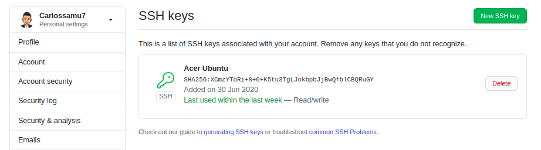
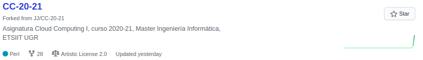
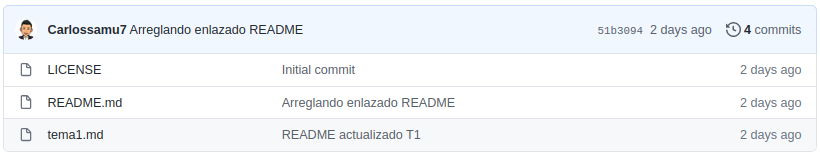
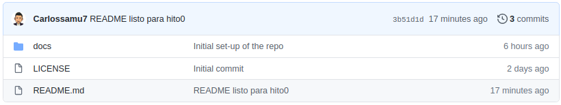
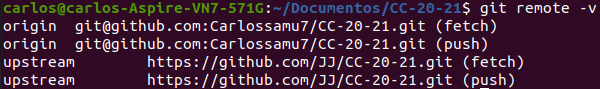
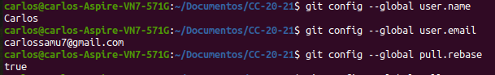

# Preparación del ambiente de trabajo

La puesta en el ambiente de trabajo de la asignatura está explicada brevemente en este documento como parte del hito 0.

### Creación de par clave pública/privada SSH

En mi caso ya disponía de dicho par. La guía de este proceso se encuentra [aquí](https://docs.github.com/en/free-pro-team@latest/github/authenticating-to-github/connecting-to-github-with-ssh).

### Creación de repositorios para la asignatura: ejercicios de autoevaluación, proyecto y fork de la asignatura.

A continuación se muestran los tres repositorios con todos los documentos que debe de haber presentes como la licencia, el `README` y el `.gitignore` .

- `fork` de la asignatura.

- Repositorio para los ejercicios de autoevaluación del temario.

- Repositorio para el proyecto.

### Configuración de los remotes correcto para repositorio CC-20-21.

Definimos el  repositorio `upstream` con la orden:

`git remote add upstream https://github.com/JJ/CC-20-21.git `

y acualizaremos con

`git pull upstream master --rebase`.

Comprobamos:

### Configuración de git local correcta: nombre, dirección de correo electrónico, configuración de rebase.

Toda la información está debidamente actualizada.

Configuración de `pull --rebase` por defecto:

